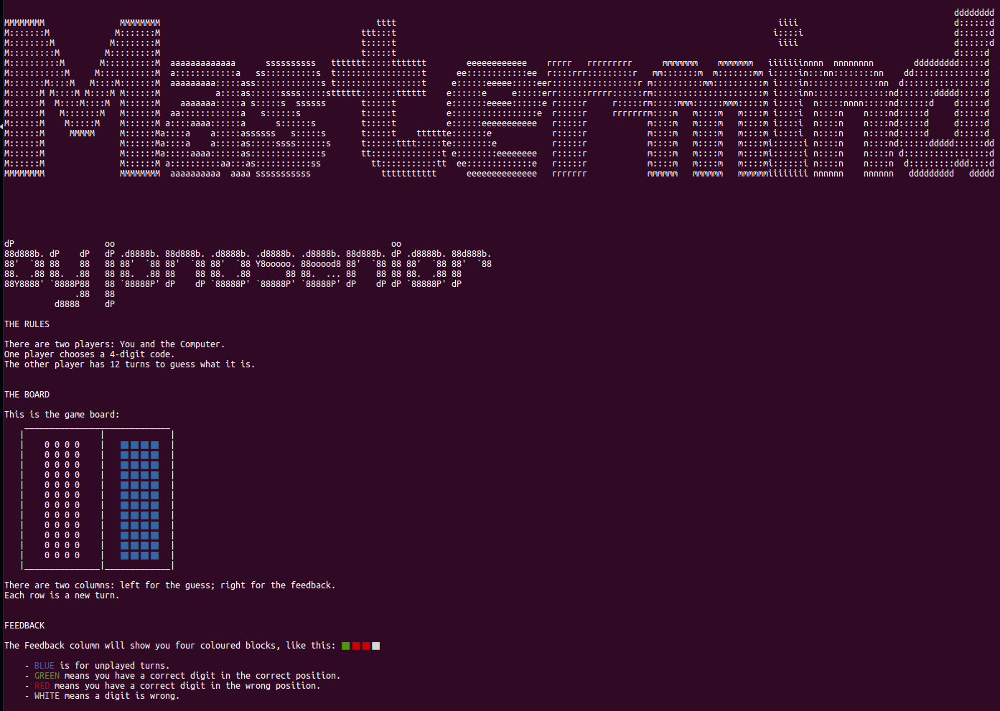
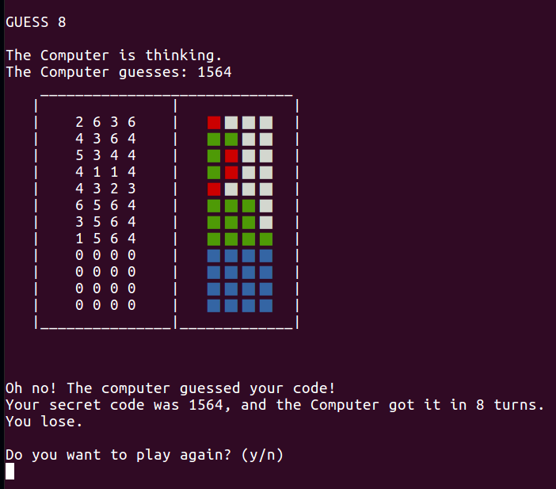

# Mastermind Game

** Note: I'm proud of this game, especially the AI, but it represents an early stage of my coding journey and all the bad practices that go along with that. For example many of the methods are chained together making them impossible to test. For a better-coded game, see [my version of chess](https://github.com/Jonosenior/chess). **

This is a 1-player, command line version of the board game Mastermind.

You can play as either the Codebreaker (the computer will set a code for you to crack in 12 turns), or the Codemaker (you set the code which the AI tries to guess).

The code is four digits long, using the numbers 1-6. Each turn the game gives you feedback on your guess - coloured pegs telling you how many correctly-placed digits you have, how many correct but wrongly-placed digits, and how many wrong digits.

The game features a strong AI with a 100% win-rate as the Codebreaker.




It's a project from [The Odin Project](https://www.theodinproject.com/courses/ruby-programming/lessons/oop).


## Installation

Open your terminal/command line. Navigate to the directory where you want this project to go. Type:
```
$ gem install colorize
$ git clone https://github.com/Jonosenior/mastermind.git
$ cd mastermind
$ ruby mastermind.rb
```

## Pre-project thoughts

There are two goals:
  1. Create a working game that the user can play against the computer.
  2. Write an AI that can guess the player's code.

This will be my most complex project to date, and my first time using multiple classes split into separate files. It will also be my first game featuring an AI of any kind.

## Post-project thoughts


  * I used the Colorize gem to display the coloured pegs in Terminal.

  * When you iterate through an array to delete certain elements, iterate through a copy of the array (using #dup) rather than the array you're deleting elements from. Otherwise, the iterator will miss values as their indices change. This mistake had me totally stumped and messed with my AI for about two days before I finally got some help from helpful Github user Sekmo.

# The AI

The AI went through several versions before the current version with a 100% win-rate. It creates an array of all possible answers (1296 in total) and chooses a random element from this array as its guess. It then checks the feedback it receives for this guess (just the green pegs) against all possible answers. It removes any answers incompatible with the current feedback, then makes another guess.

## Todo

- The AI could be further optimised by implementing a minmax technique to choose the most efficient guess (rather than just a random one). This would increase processing time, but the AI would be guaranteed to win within 5 moves. More information [here](https://en.wikipedia.org/wiki/Mastermind_(board_game)#Five-guess_algorithm).

- Create a front-end so it's playable on the browser or an app.
